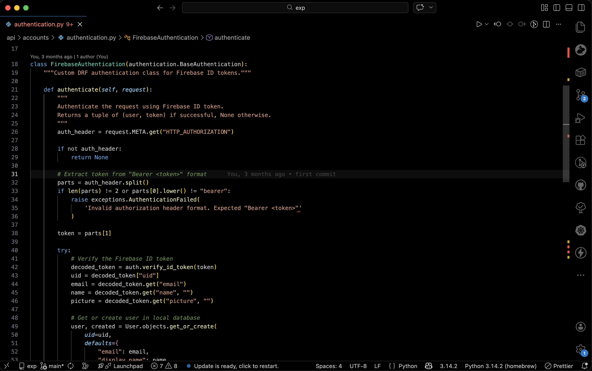
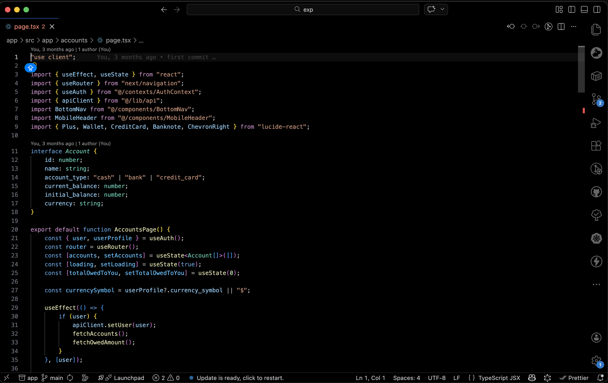
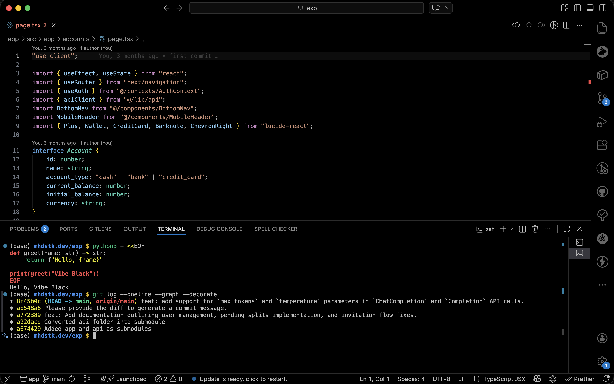

# Vibe Black — True AMOLED Coding Theme

> A pure black, ultra-minimal theme designed for long coding sessions and zero distractions.

---

## ✨ Why Vibe Black?

- 🖤 **True AMOLED Black** — real `#000000` background (battery friendly)
- 🧠 **Low Cognitive Load** — no visual noise, just code
- ⚡ **Performance Friendly** — minimal rendering overhead
- 👀 **Easy on Eyes** — optimized contrast for long sessions

---

## 🎨 Variants

- **Vibe Black** → Pure black, maximum contrast
- **Vibe Black Lite** → Slightly softer for better readability in bright environments

---

## 🖥️ Screenshots

### Python



### JavaScript



### Terminal + UI



---

## 🧩 Optimized For

- Python (Pylance-style clarity)
- JavaScript / TypeScript
- Rust
- JSON / YAML

---

## 🚀 Installation

1. Open Extensions (`Ctrl+Shift+X`)
2. Search for **Vibe Black**
3. Click Install
4. Select theme:
    - `Vibe Black`
    - `Vibe Black Lite`

---

## ⚙️ Recommended Settings

```json
"editor.semanticHighlighting.enabled": true,
"editor.fontLigatures": true,
"workbench.colorTheme": "Vibe Black"
```

---

## 🧠 Philosophy

Most themes try to look _beautiful_.
Vibe Black is built to be **invisible** — so you can focus on thinking, not UI.

---

## 💬 Feedback & Contributions

Found an issue or want improvements?
Open an issue or PR — contributions are welcome.

GitHub: https://github.com/mhdstk/vibe-black

---

## ⭐ Support

If you like this theme, consider leaving a rating ⭐
It helps a lot!
