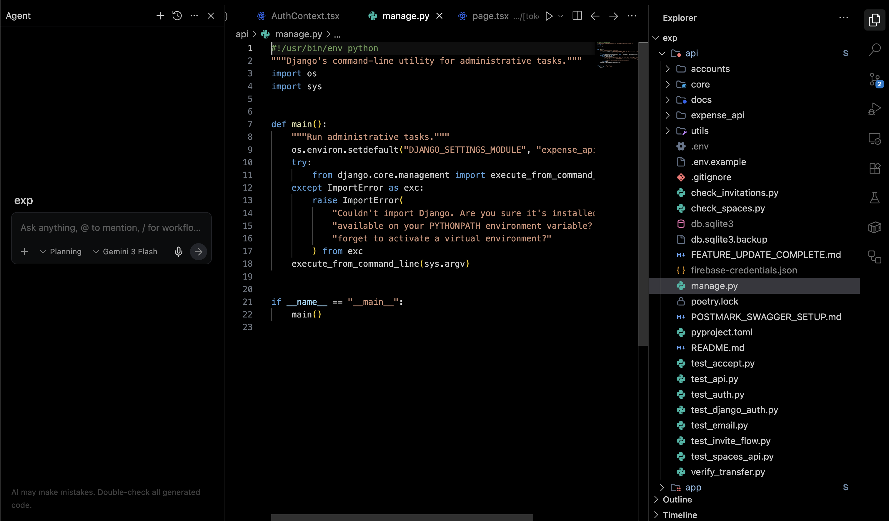

# Vibe Black

A seamless, deep black theme for VS Code and compatible editors.

## Preview

## Features

- True dark surfaces for low-glare coding sessions
- Balanced syntax colors for Python, JavaScript, TypeScript, JSON, and Markdown
- High-contrast UI elements while keeping a calm visual tone

## Installation

Search for `mhdstk.vibe-black` in the Extensions marketplace and click Install.

## Activate Theme

1. Open Command Palette (`Cmd+Shift+P` on macOS, `Ctrl+Shift+P` on Windows/Linux)
2. Run `Preferences: Color Theme`
3. Select `Vibe Black`

## Repository

- GitHub: https://github.com/mhdstk/vibe-black
- License: MIT
